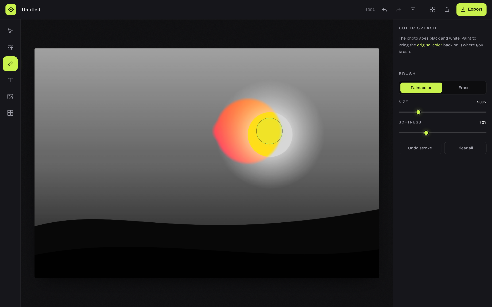
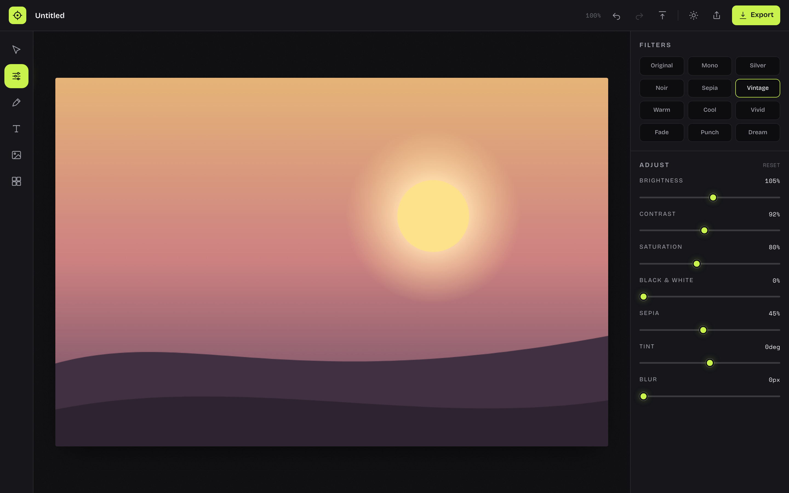
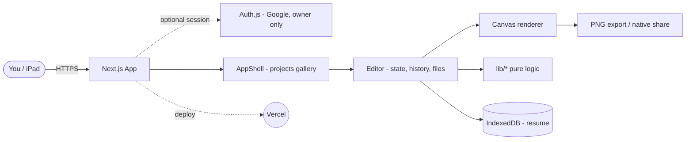
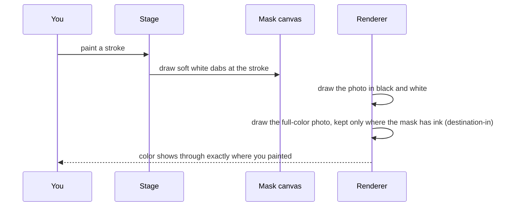

# Precision

A fast, lightweight browser photo editor. Drop an image, tone it black and white, apply filters, add text, build collages, layer images, and brush the original color back with the selective-color brush. iPad and Apple Pencil ready. Everything runs on your device.



[](LICENSE)


**Live:** [precision-bheng.vercel.app](https://precision-bheng.vercel.app)

## Contents

- [Features](#features)
- [Architecture](#architecture)
- [Tech stack](#tech-stack)
- [Quick start](#quick-start)
- [Configuration](#configuration)
- [Project layout](#project-layout)
- [Design decisions and trade-offs](#design-decisions-and-trade-offs)
- [License](#license)

## Features

- **Color-splash brush** - the photo drops to black and white; paint to bring the original color back only where you brush. Paint and erase modes, adjustable size and softness, Apple Pencil pressure, per-stroke undo.
- **Tone and filters** - 12 one-tap looks (Noir, Silver, Sepia, Vintage, Warm, Cool, Vivid, Fade, Punch, Dream, ...) plus brightness, contrast, saturation, black and white, sepia, tint, and blur sliders.
- **Text** - multi-line captions with font, weight, italic, alignment, size, letter spacing, rotation, opacity, color, and highlight.
- **Collages** - 7 layouts (side by side, stacked, 2x2, triptych, big-left, film strip) with a per-cell photo fill and a backdrop color.
- **Image layers** - drop images on top of images, then move, resize, rotate, round the corners, reorder, and duplicate.
- **Projects** - every project (images and the brush mask) is saved locally in the browser. A gallery lets you resume or delete past work.
- **Export and share** - download a PNG, or share straight to iMessage / AirDrop through the native share sheet.
- **Owner-only access** - optional Google sign-in locked to a single email.
- **Light and dark**, responsive, and iPad friendly.



## Architecture

Precision is a fully client-side editor. Pure, framework-free logic lives in `lib/*` and is unit-tested; a single deterministic canvas renderer is shared by the live stage and the exporter, so what you see is exactly what you save. Images never leave the device.



| Layer | Role |
|-------|------|
| `lib/*` | Pure, tested logic: filters, geometry, collage layouts, undo/redo history, color, project store |
| `components/render.ts` | Deterministic canvas compositor shared by the live stage and export |
| `components/*.tsx` | UI: Editor orchestrator, Stage (canvas + pointer/brush), TopBar, Toolbar, RightPanel, DropZone |
| `hooks/*` | Image cache and theme (`useSyncExternalStore`) |
| `auth.ts` + `app/api/auth` | Optional owner-only Google sign-in |

### How the color-splash brush works

The brush is the heart of the app, and it is a two-draw composite rather than a per-pixel loop:



## Tech stack

- **Next.js 16** (App Router) and **React 19**
- **TypeScript** (strict) and **Tailwind CSS v4**
- **HTML5 Canvas 2D** for all rendering (GPU `ctx.filter`, no heavy image libraries)
- **Auth.js** (NextAuth v5) for optional Google sign-in
- **IndexedDB** for local-first project storage
- **node:test** (28 unit tests) and **Playwright** (10 e2e, desktop + iPad)
- **Vercel** hosting, **GitHub Actions** CI

## Quick start

```bash
git clone https://github.com/bunlongheng/precision.git
cd precision
npm install
npm run dev
```

Open [http://localhost:3040](http://localhost:3040). Drop a photo and start editing - no account or setup required.

```bash
npm run typecheck   # tsc --noEmit
npm run lint        # eslint
npm test            # 28 unit tests (node:test)
npm run test:e2e    # 10 Playwright specs
```

## Configuration

No environment variables are required - the app runs fully open by default. To lock it to a single Google account, copy `.env.example` to `.env.local` and set:

| Env var | Required | Purpose |
|---------|----------|---------|
| `AUTH_GOOGLE_ID` | to enable auth | Google OAuth client id |
| `AUTH_GOOGLE_SECRET` | to enable auth | Google OAuth client secret |
| `AUTH_SECRET` | when auth is on | Session encryption secret (`openssl rand -base64 32`) |
| `AUTH_OWNER_EMAIL` | optional | The only email allowed to sign in |

When the Google values are unset, sign-in is disabled and the editor is open. When they are set, only `AUTH_OWNER_EMAIL` can hold a session.

## Project layout

```
precision/
  app/
    layout.tsx          # fonts, metadata, theme bootstrap
    page.tsx            # auth gate -> SignIn or AppShell
    manifest.ts         # PWA / add-to-home-screen
    api/auth/[...nextauth]/route.ts
  components/
    AppShell.tsx        # projects gallery + view switch
    Editor.tsx          # state, history, brush mask, files, export, share
    Stage.tsx           # canvas + pointer handling + color-splash brush
    render.ts           # canvas compositor (live + export)
    TopBar / Toolbar / RightPanel / DropZone / SignIn / ui / icons
  lib/
    types.ts filters.ts geometry.ts collage.ts history.ts color.ts projectStore.ts
  hooks/
    useImageCache.ts useTheme.ts
  tests/                # 28 node:test unit tests
  e2e/                  # 10 Playwright specs
  auth.ts               # optional owner-only Google sign-in
```

## Design decisions and trade-offs

| Decision | Chosen | Alternative | Why this trade-off | Cost we accept |
|----------|--------|-------------|--------------------|----------------|
| Rendering | Native Canvas 2D + `ctx.filter` | fabric.js / konva | Tiny bundle, GPU filters, "fast and light" | More manual layer math |
| Filters | CSS filter string | per-pixel JS loops | Hardware accelerated, smooth on iPad | Limited to CSS filter primitives |
| Storage | IndexedDB, images as data URLs | server + database | Local-first, private, zero backend | No cross-device sync |
| Working size | Cap imports to 2048px | full-resolution edit | Keeps every operation fast | Very large prints lose detail |
| Auth | Optional, fail-open | always required | App deploys and demos without credentials | Must set env to actually lock it |

## License

[MIT](LICENSE) (c) 2026 Bunlong Heng
